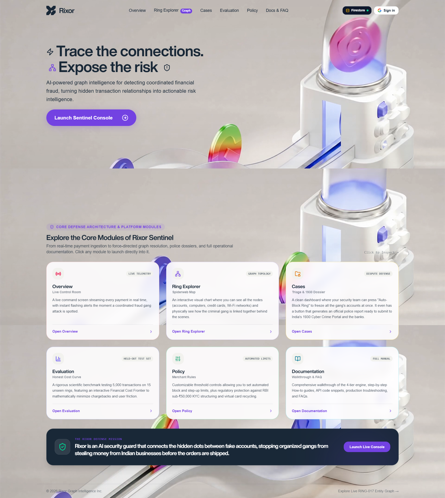
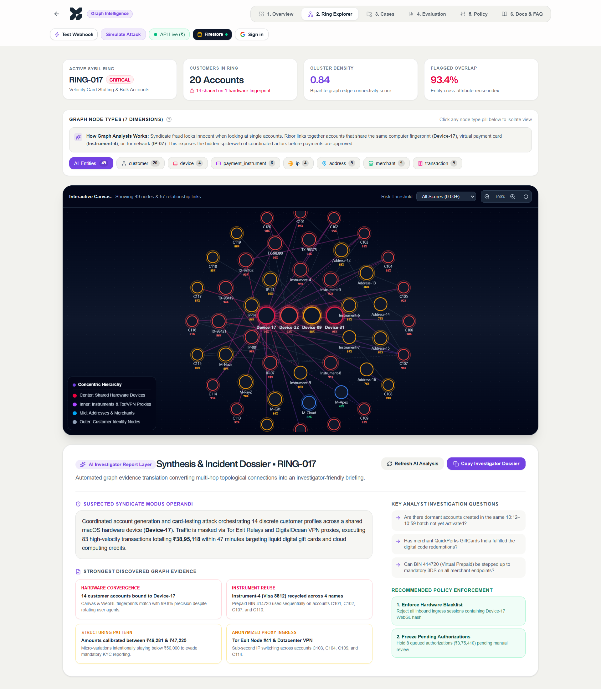
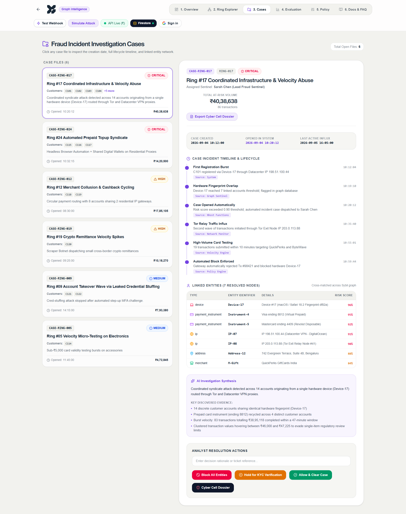
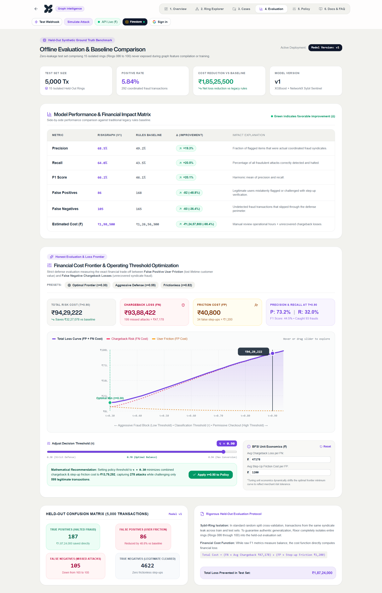
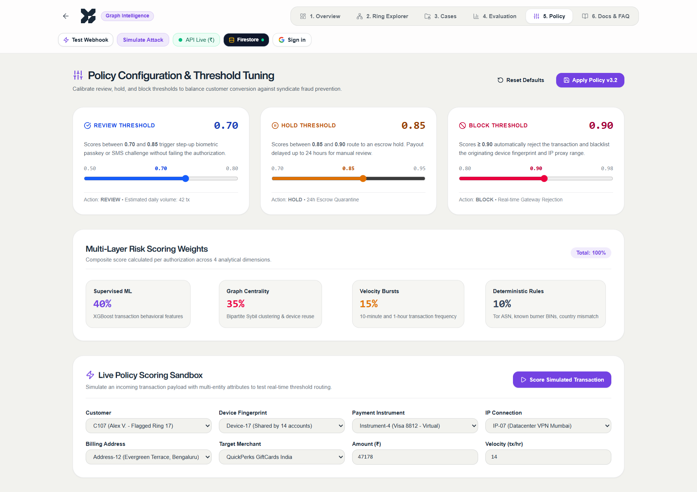
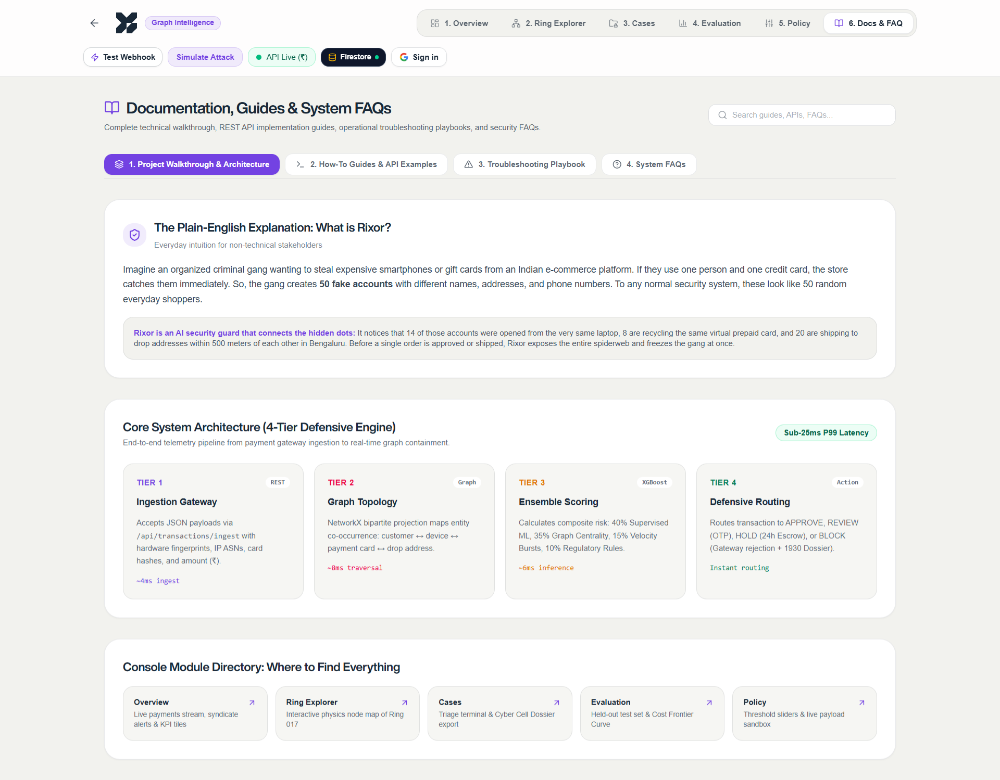

<div align="center">

# RIXOR SENTINEL

### Real-Time Graph Intelligence for Coordinated Payment Fraud & Sybil Attacks

**Detect the ring. Explain the risk. Contain the attack.**

[](https://www.python.org/)
[](https://fastapi.tiangolo.com/)
[](https://react.dev/)
[](https://www.typescriptlang.org/)
[](https://firebase.google.com/)
[](https://xgboost.readthedocs.io/)
[](#)

**Rixor Sentinel** is a graph-first fraud intelligence platform designed for payment ecosystems where coordinated attackers can evade transaction-by-transaction rules.

</div>

---

## 🏆 Why Rixor?

Traditional fraud checks often ask:

> “Is this transaction suspicious?”

Rixor asks the more important question:

> **“Are these transactions connected?”**

A single customer, device, IP, address, or payment instrument may look harmless in isolation. When the same infrastructure connects multiple identities, the graph can reveal a coordinated abuse ring.

Rixor turns those relationships into:

**Transaction → Evidence → Risk Score → Ring → Case → Action**

---

## ⚡ What the demo shows

| Capability | What a judge can see |
|---|---|
| **Live ingestion** | Payment-style webhook enters the risk pipeline |
| **Graph intelligence** | Shared devices, IPs and instruments connect entities |
| **Risk ensemble** | ML + graph + velocity + rules produce an explainable score |
| **Ring detection** | Related customers are grouped into an investigation ring |
| **Evidence** | Every decision includes human-readable risk signals |
| **Policy engine** | Thresholds control ALLOW / REVIEW / HOLD / BLOCK |
| **Analyst workflow** | Cases, policy controls and investigation views |
| **Real-time updates** | SSE streams newly scored transactions to the console |
| **Evidence dossier** | Ring evidence can be packaged and SHA-256 signed |
| **Resilient local mode** | Backend works without a trained model or cloud persistence |

---

## 🧠 Architecture

```text
                    PAYMENT TRANSACTION
                           │
                           ▼
                ┌─────────────────────┐
                │   FastAPI Gateway   │
                │ auth • validation   │
                │ idempotency         │
                └──────────┬──────────┘
                           │
                           ▼
             ┌───────────────────────────┐
             │     GRAPH INTELLIGENCE    │
             │                           │
             │ Customer ─ Device         │
             │    │       │              │
             │    ├──── IP ─────┐        │
             │    └ Payment ────┘        │
             │                           │
             │ clusters • centrality     │
             │ connected components      │
             │ similarity / collisions   │
             └─────────────┬─────────────┘
                           │
                           ▼
              ┌────────────────────────┐
              │   ENSEMBLE RISK ENGINE │
              │                        │
              │ 40% ML                 │
              │ 35% Graph              │
              │ 15% Velocity           │
              │ 10% Rules              │
              └────────────┬───────────┘
                           │
                           ▼
                 ┌──────────────────┐
                 │ POLICY + ROUTING │
                 │                  │
                 │ ALLOW            │
                 │ MONITOR          │
                 │ REVIEW           │
                 │ HOLD             │
                 │ BLOCK            │
                 └────────┬─────────┘
                          │
             ┌────────────┴────────────┐
             ▼                         ▼
      Analyst Console             Evidence
      rings • cases                dossier
      policy • eval                + audit
```

Full architecture notes: [`docs/ARCHITECTURE.md`](docs/ARCHITECTURE.md)

---

## 🔬 Risk model

Rixor combines four complementary signal families:

```text
                     ┌───────────┐
                     │ ML SCORE  │  40%
                     └─────┬─────┘
                           │
┌────────────┐             │             ┌────────────┐
│ GRAPH      │  35% ──────┼────── 15%  │ VELOCITY   │
│ INTEL      │             │             │            │
└────────────┘             │             └────────────┘
                           │
                     ┌─────▼─────┐
                     │   RULES   │  10%
                     └───────────┘
                           │
                           ▼
                     FINAL RISK SCORE
```

The system is designed for **explainability**, not just a black-box number. A score is accompanied by evidence such as:

- hardware/device collision
- recycled payment instrument
- anonymous proxy / datacenter ingress
- KYC structuring pattern
- known syndicate entity
- burst / velocity behavior

---

## 🎯 Routing policy

| Score | Band | Action |
|---:|---|---|
| `< 0.40` | LOW | ALLOW |
| `0.40 – 0.55` | MONITOR | ALLOW + soft flag |
| `0.55 – 0.75` | HIGH / REVIEW | REVIEW |
| `0.75 – 0.88` | CRITICAL / HOLD | HOLD |
| `≥ 0.88` | CRITICAL | BLOCK |

Thresholds can be tuned through the analyst policy workflow.

---

## 🖥️ Repository structure

```text
rixor-sentinel/
│
├── frontend/                 # React + TypeScript analyst console
│   ├── src/
│   │   ├── components/
│   │   ├── data/
│   │   ├── pages/
│   │   ├── firebase.ts
│   │   └── riskEngine.ts
│   ├── package.json
│   └── .env.example
│
├── backend/                  # Python + FastAPI intelligence service
│   ├── app/
│   │   ├── routes/
│   │   ├── graph_engine.py
│   │   ├── risk_engine.py
│   │   ├── ml_scorer.py
│   │   ├── rules_engine.py
│   │   ├── velocity.py
│   │   └── dossier.py
│   ├── ml/
│   ├── tests/
│   ├── requirements.txt
│   └── Dockerfile
│
├── docs/
│   └── ARCHITECTURE.md
│
├── .gitignore
└── README.md
```

---

## 🚀 Run locally

### 1. Backend

```bash
cd backend

python -m venv .venv

# Windows
.venv\Scripts\activate

# macOS/Linux
source .venv/bin/activate

pip install -r requirements.txt
copy .env.example .env
uvicorn app.main:app --host 0.0.0.0 --port 8000 --reload
```

Backend API:

`http://localhost:8000`

Swagger:

`http://localhost:8000/docs`

### 2. Frontend

In a second terminal:

```bash
cd frontend
npm install
copy .env.example .env.local
npm run dev
```

The frontend configuration is environment-based so Firebase configuration does not have to be committed into source control.

---

## 🧪 Test the backend

```bash
cd backend
pytest -v
```

Example webhook:

```json
{
  "transaction_id": "TX-2026-98421",
  "customer_id": "C107",
  "merchant_id": "M-Gift",
  "amount": 47225,
  "currency": "INR",
  "device_id": "Device-17",
  "ip_address": "103.21.244.12",
  "payment_instrument_id": "Instrument-4",
  "timestamp": "2026-09-05T10:45:00Z"
}
```

---

## 🔐 Security

This repository intentionally excludes:

- `.env` files
- production webhook secrets
- Firebase service-account credentials
- generated model artifacts
- local virtual environments
- dependency/build output

Use the provided `.env.example` files as templates.

> **Important:** frontend Firebase web configuration is not equivalent to a server credential, but API keys should still be restricted in Google Cloud and Firestore security rules must be configured correctly.

---

## 🏗️ Technology stack

**Frontend**
- React 19
- TypeScript
- Vite
- Framer Motion
- Lucide
- Firebase Auth + Firestore

**Backend**
- Python
- FastAPI
- NetworkX
- XGBoost
- Pydantic
- Firestore
- Server-Sent Events

**Intelligence**
- graph-based entity linkage
- connected-component ring detection
- device/IP/instrument collision analysis
- velocity detection
- explainable policy rules
- held-out ring model evaluation

---

## 💡 Buildathon story

Rixor is designed around a simple principle:

**Fraud is often a network problem disguised as a transaction problem.**

Instead of blocking legitimate users based on isolated heuristics, Rixor builds context around every transaction and gives investigators an evidence-backed path from a suspicious event to the broader coordinated ring.

That makes the system useful not only for **real-time prevention**, but also for **post-transaction investigation and response**.

---

## 📌 Competition demo flow

```text
1. Open Rixor
       ↓
2. Show live analyst console
       ↓
3. Ingest a suspicious transaction
       ↓
4. Risk engine scores it
       ↓
5. Graph links it to related entities
       ↓
6. Ring-017 appears
       ↓
7. Evidence explains WHY it is risky
       ↓
8. Analyst opens a case
       ↓
9. Policy decides REVIEW / HOLD / BLOCK
       ↓
10. Evidence dossier can be generated
```

---

<div align="center">

### RIXOR SENTINEL

**See the transaction. Discover the network. Stop the ring.**

Built for the Razorpay Buildathon.

</div>


## Product Screenshots

The deployed Rixor experience is designed as an analyst-first security console, with dedicated views for live monitoring, ring exploration, investigation cases, evaluation, policy controls, and documentation.

### Landing & Command Center

<p align="center">
  
</p>

### Ring Explorer — Relationship Intelligence

<p align="center">
  
</p>

### Fraud Investigation Cases

<p align="center">
  
</p>

### Evaluation & Cost Frontier

<p align="center">
  
</p>

### Policy Configuration

<p align="center">
  
</p>

### Documentation & System Architecture

<p align="center">
  
</p>

